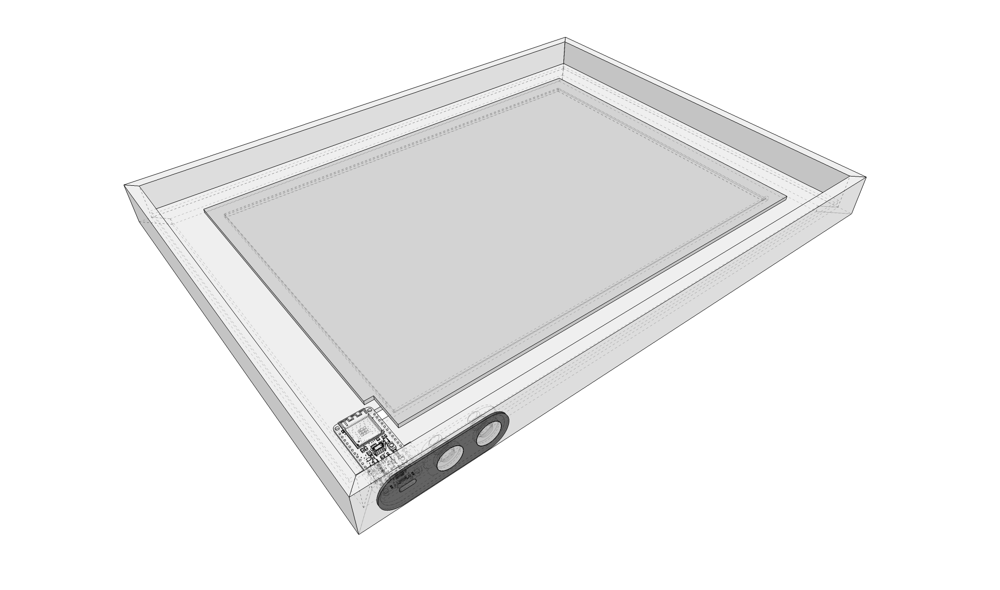

# LEDFRAME.01

This is a small project creating a smart backlit frame from an [A4 led lightplate](https://www.amazon.de/Leuchttisch-Ultra-d%C3%BCnne-Leuchtplatte-Typ-C-USB-Stromkabel-R%C3%B6ntgenbetrachtung/dp/B0BMLKCZSZ/ref=sr_1_2_sspa?th=1) and an (IKEA Rödalm)[https://www.ikea.com/at/de/p/roedalm-bilderrahmen-schwarz-20548918/] frame.

The frame has controls for manual operation, but also implements MQTT for integration into smart home platforms.

